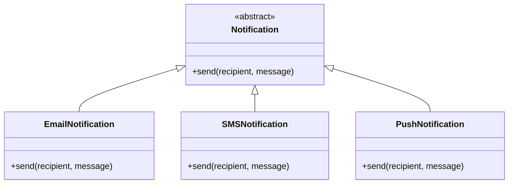
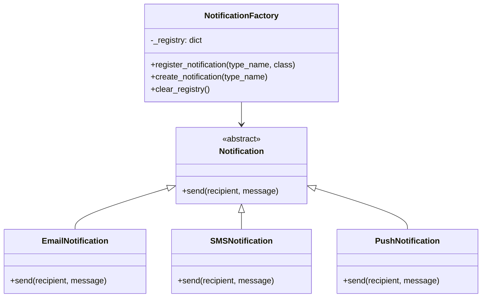

# Faz 1 — Mimari Diyagram

## Önce (Faz 0 — Başlangıç Kodu)

```mermaid
classDiagram
    class Notification {
        <<abstract>>
        +send(recipient, message)
    }

    class EmailNotification {
        +send(recipient, message)
    }

    class SMSNotification {
        +send(recipient, message)
    }

    class PushNotification {
        +send(recipient, message)
    }

    Notification <|-- EmailNotification
    Notification <|-- SMSNotification
    Notification <|-- PushNotification
```

## Sonra (Faz 1 — Factory + Registry)

```mermaid
classDiagram
    class Notification {
        <<abstract>>
        +send(recipient, message)
    }

    class EmailNotification {
        +send(recipient, message)
    }

    class SMSNotification {
        +send(recipient, message)
    }

    class PushNotification {
        +send(recipient, message)
    }

    class NotificationFactory {
        -_registry: dict
        +register_notification(type_name, class)
        +create_notification(type_name)
        +clear_registry()
    }

    Notification <|-- EmailNotification
    Notification <|-- SMSNotification
    Notification <|-- PushNotification
    NotificationFactory --> Notification
```