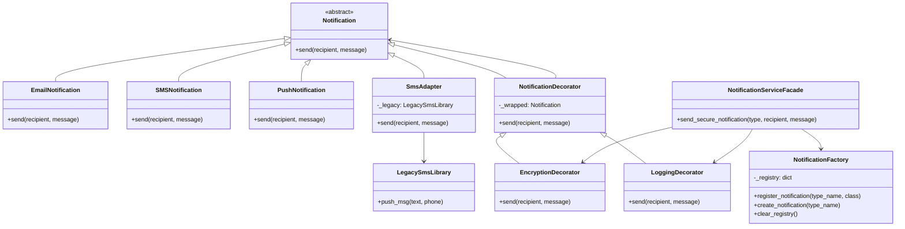

# Faz 2 — Mimari Diyagram

## Sınıf Diyagramı

```mermaid
classDiagram
    class Notification {
        <<abstract>>
        +send(recipient, message)
    }

    class EmailNotification {
        +send(recipient, message)
    }

    class SMSNotification {
        +send(recipient, message)
    }

    class PushNotification {
        +send(recipient, message)
    }

    class NotificationFactory {
        -_registry: dict
        +register_notification(type_name, class)
        +create_notification(type_name)
        +clear_registry()
    }

    class LegacySmsLibrary {
        +push_msg(text, phone)
    }

    class SmsAdapter {
        -_legacy: LegacySmsLibrary
        +send(recipient, message)
    }

    class NotificationDecorator {
        -_wrapped: Notification
        +send(recipient, message)
    }

    class EncryptionDecorator {
        +send(recipient, message)
    }

    class LoggingDecorator {
        +send(recipient, message)
    }

    class NotificationServiceFacade {
        +send_secure_notification(type, recipient, message)
    }

    Notification <|-- EmailNotification
    Notification <|-- SMSNotification
    Notification <|-- PushNotification
    Notification <|-- SmsAdapter
    Notification <|-- NotificationDecorator

    SmsAdapter --> LegacySmsLibrary

    NotificationDecorator <|-- EncryptionDecorator
    NotificationDecorator <|-- LoggingDecorator
    NotificationDecorator --> Notification

    NotificationServiceFacade --> NotificationFactory
    NotificationServiceFacade --> EncryptionDecorator
    NotificationServiceFacade --> LoggingDecorator
```