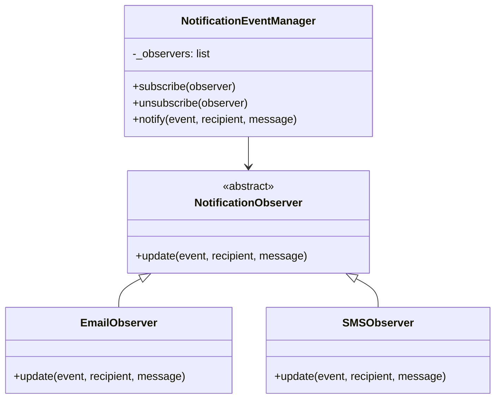
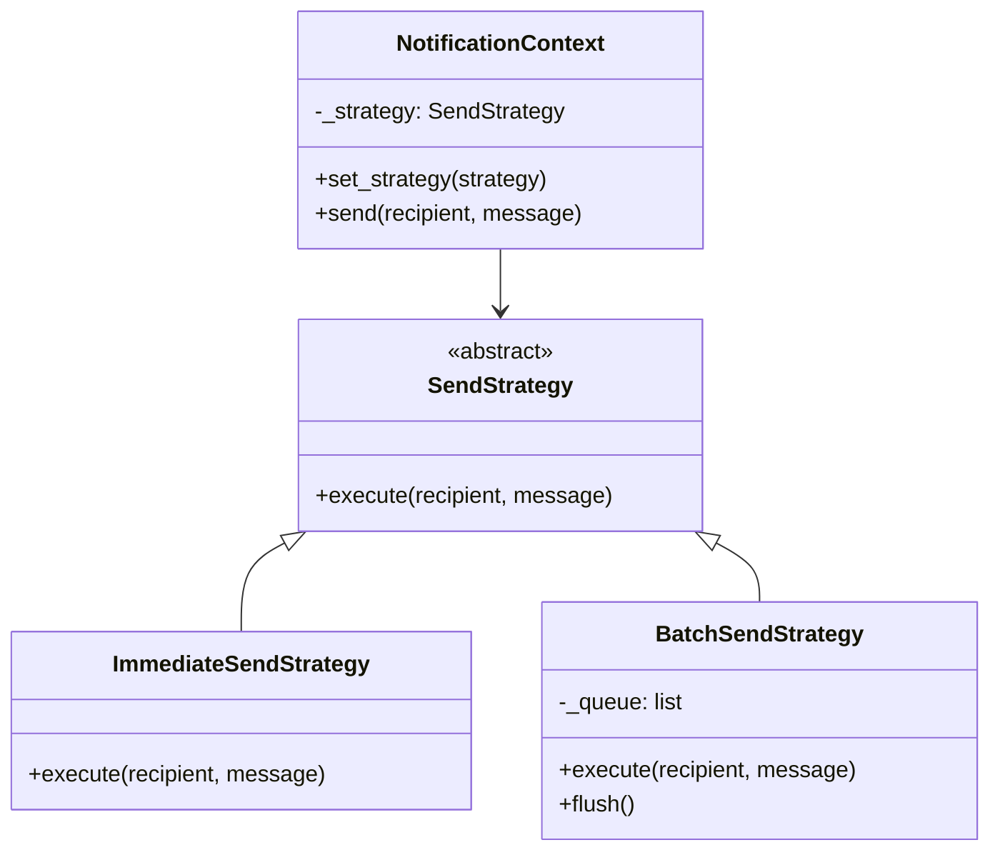

# Faz 3 — Mimari Diyagram

## Observer Pattern

```mermaid
classDiagram
    class NotificationObserver {
        <<abstract>>
        +update(event, recipient, message)
    }

    class EmailObserver {
        +update(event, recipient, message)
    }

    class SMSObserver {
        +update(event, recipient, message)
    }

    class NotificationEventManager {
        -_observers: list
        +subscribe(observer)
        +unsubscribe(observer)
        +notify(event, recipient, message)
    }

    NotificationObserver <|-- EmailObserver
    NotificationObserver <|-- SMSObserver
    NotificationEventManager --> NotificationObserver
```

## Strategy Pattern

```mermaid
classDiagram
    class SendStrategy {
        <<abstract>>
        +execute(recipient, message)
    }

    class ImmediateSendStrategy {
        +execute(recipient, message)
    }

    class BatchSendStrategy {
        -_queue: list
        +execute(recipient, message)
        +flush()
    }

    class NotificationContext {
        -_strategy: SendStrategy
        +set_strategy(strategy)
        +send(recipient, message)
    }

    SendStrategy <|-- ImmediateSendStrategy
    SendStrategy <|-- BatchSendStrategy
    NotificationContext --> SendStrategy
```